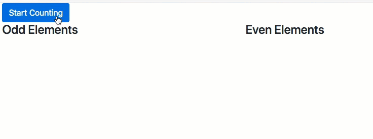

# angular-cases
Examples form tutorials, or test run from forum discussion, or small angular projects.

**[recipe-book](./recipe-book)**\
Manage personal recipes and generate shopping list. See the app [in action](https://recipe-practice.firebaseapp.com).\

**[google-map-api-setup](./google-map-api-setup)**\
Mark a location on google map by calling Google Map API. See the app [in action](https://map-api-setup.firebaseapp.com/).\
Step-by-step instructions on setting up Google console and get a token to enable Angular code to display a google map with a location marker.

**[google-map-direction-api-setup](./google-map-direction-api-setup)**\
Show directions between two locations on google map by calling Google Map API and Google Direction API. The estimated time of arrival is also given. See the app [in action](https://map-direction-api-setup.firebaseapp.com/).

**[google-map-track-location](./google-map-track-location)**\
Track your current location on Google Map. Show in real time the path between your current location and the destination while you move. Customize the location marker. See the app [in action](https://map-track-location.firebaseapp.com/).

**[data-binding-practice](./data-binding-practice)**\
Demonstrate string interpolation, property binding, event binding, and 2-way binding. It is course practice of Udemy “Augular 8 (formerly Angular 2) - The complete Guide”, Assignment 2 “Practicing Databinding”. See the app [in action](https://data-binding-practice.firebaseapp.com/).

**[directive-practice](./directive-practice)**\
Demonstrate structural directive (ngFor and ngIf) and attribute direction (ngStyle and ngClass). It is course practice of Udemy “Augular 8 (formerly Angular 2) - The complete Guide”, Assignment 3 “Practicing Directive”. See the app [in action](https://directive-practice.firebaseapp.com/).

**[custom-data-binding-practice](./custom-data-binding-practice)**\
Demonstrate custom property and event binding with @Input and @Output. It is course practice of Udemy “Augular 8 (formerly Angular 2) - The complete Guide”, Assignment 4 “Practicing property and event binding”. See the app [in action](https://custom-databinding-practice.firebaseapp.com/).

**[service-practice](./service-practice)**\
Demonstrate using Service to centralize function and share data. It is course practice of Udemy “Augular 8 (formerly Angular 2) - The complete Guide”, Assignment 5 “Practicing Services”. See the app [in action](https://service-practice-udemy.firebaseapp.com/).

**[form-template-driven-practice](./form-template-driven-practice)**\
Demonstrate template-driven form input and validators. It is course practice of Udemy “Augular 8 (formerly Angular 2) - The complete Guide”, Assignment 6 “Practicing Template-Driven Forms”. See the app [in action](https://form-template-driven-practice.firebaseapp.com/).

'
