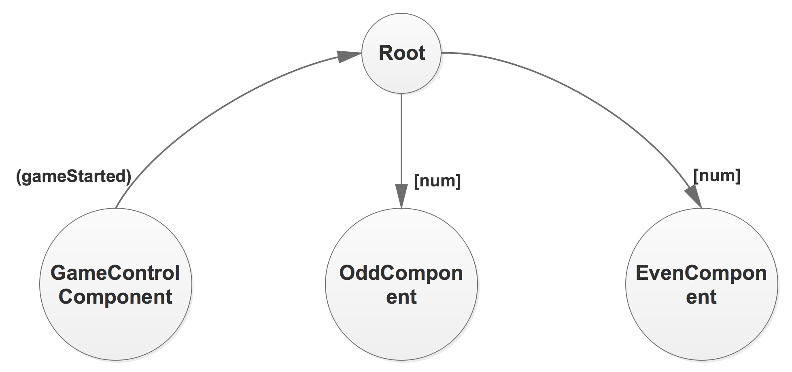

# custom-data-binding-practice
Course practice of Udemy “Augular 8 (formerly Angular 2) - The complete Guide”, Assignment 4 “Practicing property and event binding”. The requirements described as:
- Create three new components: Game Control, Odd, and Even
- The GameControl Component should have buttons to start and stop the game
- When start the game, an event (holding a incremental number) should get emitted each second (ref=setInterval())
- The vent should be listenable from outside the component
- When stopping the game, no more events should get emitted (clearInterval(ref))
- A new Odd component should get created for every odd number emitted, the same should happen for the Even component on even numbers
- Simply output Odd - NUMBER or Even - NUMBER in the two components
- Style the element (e.g. paragraph) holding your output text differently in both component.

Also see the app [in action]((https://custom-databinding-practice.firebaseapp.com/)).

## Project interface & Dataflow & Documentation
**Decompose the project into Components**

**Dataflow between Components**

**Project documentation**\
More detailed description of the code can be found in the [documentation](http://ec2-13-58-36-226.us-east-2.compute.amazonaws.com/angular-cases-docs/custom-data-binding-practice/index.html).