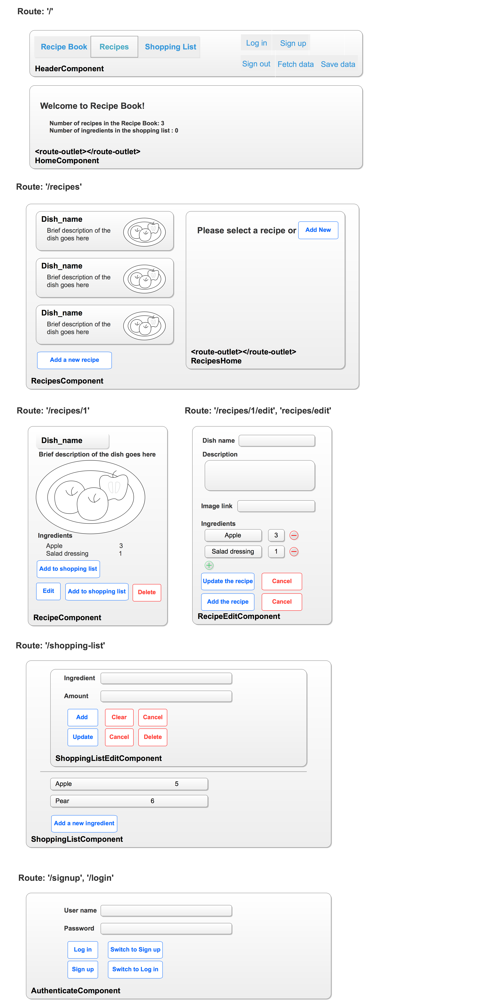
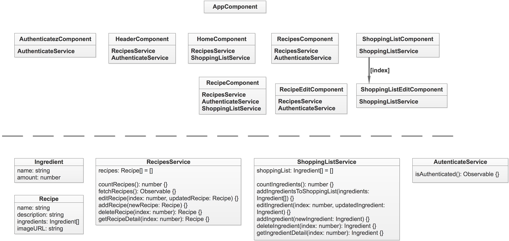

# recipe-book-practice
The functions are
- manage receipts. The operations include: list, show details, add, edit, delete, add ingredient of a recipe into the shopping list
- manage shopping list. The operations include: list, add, edit, and delete.
- authentication. The operations include sign up, log in.
The receipts and shopping list info are saved in Server and can be fetched, modified, and saved through Web API once authenticated.

Also see the app [in action](https://recipe-practice.firebaseapp.com/).

## Project interface & Dataflow & Documentation
**Decompose the project into Components**

**Dataflow between Components**

**Project documentation**\
More detailed description of the code can be found in the [documentation](http://ec2-3-15-194-248.us-east-2.compute.amazonaws.com/angular-cases-docs/recipe-book/index.html).
