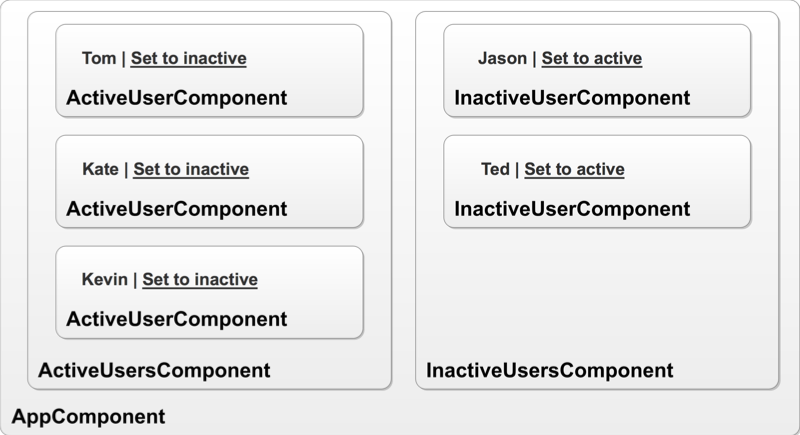
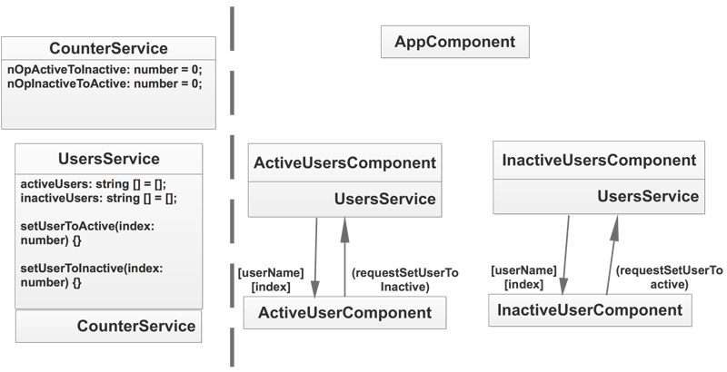

# service-practice
Course practice of Udemy “Augular 8 (formerly Angular 2) - The complete Guide”, Assignment 5 “Practicing Services”. The requirements described as:
- Create two new components: ActiveUsersComponent and InactiverUsersComponent
- The ActiveUserComponent list the name of active users, and interact with the user to set any of the active users to inactive.
- The InactiveUserComponent list the name of inactive users, and interact with the user to set any of the inactive users to active.
- Use a UsersService which manages the active and inactive users.
- Use a CounterService which counts the number of active->inactive and inactive->active actions.

Also see the app [in action](https://service-practice-udemy.firebaseapp.com).

## Project interface & Dataflow & Documentation
**Decompose the project into Components**

**Data flow between Components and Services**

**Project documentation**\
More detailed description of the code can be found in the [documentation](http://ec2-3-15-194-248.us-east-2.compute.amazonaws.com/angular-cases-docs/service-practice/index.html).
